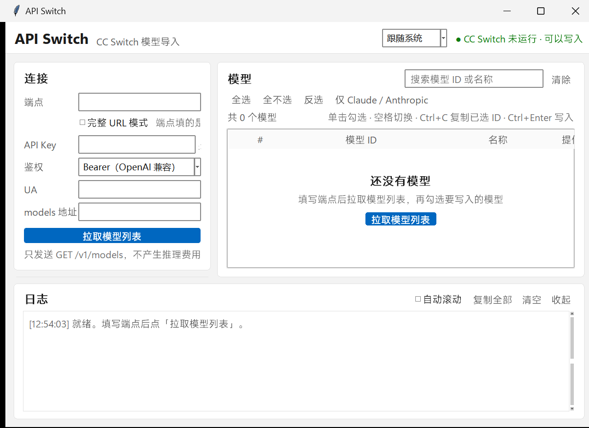

# API Switch

给 **CC Switch** 批量导入模型的桌面小工具：填一个中转端点 → 拉取 `/v1/models` → 勾选想要的模型 → 直接写进 CC Switch。

- 只发 `GET /v1/models`，**不产生任何推理费用**
- 支持 **Claude / Codex / OpenCode** 三种供应商卡的写入方式
- 写入前自动备份，出问题可一键回滚
- 图形界面 + 命令行两种用法，零第三方依赖（只用 tkinter / urllib / sqlite3）
- 界面跟随 Windows 浅色 / 深色主题，窗口大小与位置自动记住



---

## 目录

- [使用前准备](#使用前准备)
- [运行方式](#运行方式)
- [图形界面详解](#图形界面详解)
  - [顶栏](#顶栏)
  - [连接](#连接)
  - [模型](#模型)
  - [写入目标](#写入目标)
  - [日志](#日志)
  - [对话框](#对话框)
  - [快捷键](#快捷键)
- [三种应用 × 两种模式怎么选](#三种应用--两种模式怎么选)
- [上下文长度（context / 最大输出）](#上下文长度context--最大输出)
- [备份与回滚](#备份与回滚)
- [命令行用法](#命令行用法)
- [打包成 exe](#打包成-exe)
- [测试](#测试)
- [常见问题](#常见问题)
- [文件说明](#文件说明)

---

## 使用前准备

1. 安装并**至少启动过一次 CC Switch**，让它生成配置文件：
   - 数据库：`~/.cc-switch/cc-switch.db`
   - 备份目录：`~/.cc-switch/backups/`
   - Codex 模型目录：`~/.codex/cc-switch-model-catalog.json`
2. Claude / OpenCode 写入前必须完全退出 CC Switch（包括托盘图标）。Codex 模式支持热更新：CC Switch 保持运行、路由端口不断开，程序用短事务同步数据库，再原子替换 Codex 模型目录。
3. Python 3.10+（Windows）。不需要 `pip install` 任何东西。

## 运行方式

```bash
# 图形界面
python app.py

# 命令行（不需要界面，见下文）
python ccs_models.py --help
```

也可以直接用打包好的 `dist/API-Switch.exe`（见[打包成 exe](#打包成-exe)）。

---

## 图形界面详解

界面分四个区域：顶栏、左栏（连接 / 写入目标）、右栏（模型表格）、底部日志。左栏内容超出时出现滚动条；模型表格随窗口高度伸展；窗口较大时左右两栏并排，窗口较小时整体保持可用。

### 顶栏

- 左侧是应用名；右侧是主题下拉（**跟随系统 / 浅色 / 深色**）与 CC Switch 运行状态。
- 状态点：绿色表示可以写入；红色表示 CC Switch 正在运行。Claude / OpenCode 需要先完全退出；Codex 一张卡模式支持热更新，运行中也显示绿色。
- 主题、窗口大小与位置、日志展开状态保存在 `%LOCALAPPDATA%\API-Switch\ui.json`。

### 连接

| 字段 | 说明 |
| --- | --- |
| 端点 | 中转的 base URL，例如 `https://api.example.com/v1`。程序会自动尝试 `/v1/models` |
| API Key | 点「显示」切换明文；日志里的 Key 会自动打码 |
| 鉴权 | `Bearer`（OpenAI 兼容）/ `x-api-key`（Anthropic）/ `x-goog-api-key`（Google） |
| UA | 自定义 User-Agent。部分网关按 UA 过滤，留空则用默认 |
| models 地址 | 手工指定模型列表地址，填了就只用它，不再自动推导 |
| 完整 URL 模式 | 端点填的是完整对话地址（如 `https://x.com/v1/chat/completions`）时勾选，会自动推回 `/v1/models` |

- 点「拉取模型列表」后按钮变「拉取中…」，表格顶部出现进度条，结果填入右侧表格，同时保存到 `out/models.json` 和 `out/models.txt`。
- 端点为空时会在输入框下方就地提示并聚焦，不会弹窗。
- 拉取完成后，表格上方信息行显示命中的地址与模型数量。

端点的自动兜底规则：带 `/api/claudecode`、`/api/anthropic`、`/apps/anthropic` 等兼容后缀时，会同时尝试去掉后缀后的 `/v1/models`；带 `/v1`、`/v3` 这类版本号时补 `/models`。失败时日志会打印每个候选地址的原因，可以直接把能用的地址填进「models 地址」。

### 模型

右侧表格：

- **排序**：点表头「模型 ID / 名称 / 提供方 / 上下文」循环切换升序 → 降序 → 恢复接口顺序，表头箭头指示当前方向。
- **搜索**：按模型 ID 或名称过滤，停止输入 120ms 后生效；右侧「清除」按钮清空。
- **勾选**：点一行任意位置即可切换；已勾选行显示 `☑` 与淡蓝底，鼠标悬停行高亮；按住 Shift 点选可成段勾选。
- **键盘**：方向键移动，空格切换勾选，`Ctrl+A` 勾选当前筛选结果，`Ctrl+C` 复制已选模型 ID。
- **批量选择**：全选 / 全不选 / 反选 / 仅 Claude·Anthropic（只勾 ID 里带 `claude` 或 `anthropic` 的）。
- **上下文列**：接口在 `/v1/models` 里返回了上下文长度才显示（如 `200K`、`1M`），没返回就是空白。
- 信息行显示「已选 N · 显示 N / M 个模型 · 接口给出 K 个上下文 · 当前 <模型 ID>」，太长的 ID 会缩短显示。
- 还没有模型时，表格中间显示空状态与「拉取模型列表」按钮。

### 写入目标

**模式**

- **一张卡 + 模型列表**：把所有模型塞进同一张卡（Claude 写 modelPicker，OpenCode 写 models 列表，Codex 写模型目录）。日常最常用。
- **每个模型一张卡**：以某张卡为模板，每个模型复制出一张新卡（端点、Key、环境沿用模板，只换模型名）。适合要在 CC Switch 里逐个对比/切换的场景。OpenCode 不支持这种模式，选中会自动切回 claude 并写入日志。

**目标**

- **应用**：`claude` / `codex` / `opencode`，选完会自动刷新下面的「供应商卡」下拉。
- **供应商卡**：写入的目标卡（fanout 模式下是模板卡）。下拉里是 `名称（id）`；刷新时保持当前选择，不会跳回第一张。下拉为空说明该应用下还没有卡，点右侧「新建」即可创建。
- **卡名前缀**：仅「每个模型一张卡」生效，其他模式下输入框变灰。

**选项**

| 选项 | 生效范围 | 作用 |
| --- | --- | --- |
| 只显示我选的模型 | Claude + 一张卡模式 | 覆盖内置模型列表，只留你勾选的 |
| 同时开启网关模型发现 | Claude + 一张卡模式 | 顺手写 `CLAUDE_CODE_ENABLE_GATEWAY_MODEL_DISCOVERY=1` |
| 合并到已有模型列表 | OpenCode / Codex + 一张卡模式 | 保留已有模型，只追加缺失项 |
| 上下文 / 最大输出 | OpenCode（两者）、Codex（仅上下文） | 见[下文](#上下文长度context--最大输出) |
| 同时填 Sonnet / Opus / Haiku 槽位 | 每个模型一张卡模式 | 一并写 `ANTHROPIC_DEFAULT_*_MODEL` |

每个选项右侧标注适用范围；当前模式用不到时自动变灰。

**参数**：上下文 / 最大输出支持 `256000`、`256K`、`1M` 写法。填错会就地红框提示，并在「写入并备份」上方说明原因。

**按钮**

- **写入并备份**：不可用时上方会说明原因（未勾选模型 / 未选择目标卡 / CC Switch 正在运行 / 参数有误）。
- **预览变更**：只读，先看再写。
- **回滚到备份**：把数据库和 Codex 目录还原到上一次写入前的状态，没有备份时不可用。
- 写入成功后显示备份文件名，可点「打开备份目录」。

### 日志

- 每行带时间戳，按级别着色：信息灰色、成功绿色、错误红色；错误同时弹出提示。
- 右上角：自动滚动开关、复制全部、清空、收起 / 展开。
- 日志最多保留 2000 行，长时间运行不会无限增长。

### 对话框

- **变更预览**：结构化摘要（目标卡、操作、模型列表前 12 个、备份说明），可「复制内容」或直接「写入并备份」。
- **新建卡**：应用 / 名称 / 端点 / Key / 默认模型；名称与端点必填，Key 可以留空；创建后自动选中新卡。
- **删除卡**：可搜索、可多选，按钮显示将删除的数量；删除正在使用的卡需要先勾选「强制删除」。

### 快捷键

| 按键 | 作用 |
| --- | --- |
| `Ctrl+Enter` | 写入并备份 |
| `Ctrl+F` | 聚焦搜索框 |
| `Ctrl+A` | 勾选当前筛选结果（表格聚焦时） |
| `Ctrl+C` | 复制已选模型 ID（表格聚焦时） |
| `空格` | 切换当前选中行的勾选 |
| `Esc` | 关闭对话框 |
| `F5` | 刷新供应商卡与 CC Switch 状态 |

---

## 三种应用 × 两种模式怎么选

| 应用 | 一张卡 + 模型列表 | 每个模型一张卡 |
| --- | --- | --- |
| **claude** | 写目标卡的 `modelPicker`（在 CC Switch 里以下拉形式选模型） | 每张卡一个模型，可填 Sonnet/Opus/Haiku 槽位 |
| **codex** | 同时写卡的 `modelCatalog` 和 `~/.codex/cc-switch-model-catalog.json`，并给卡挂 `model_catalog_json` | 每张卡一份 TOML 配置，`model` 各不相同 |
| **opencode** | 写目标卡 `settings_config` 里的 `models` 列表（含 context/output limit） | 不支持（OpenCode 卡自带模型列表，请用一张卡模式） |

## 上下文长度（context / 最大输出）

- **能不能自动拿到**：看中转。官方 OpenAI / Anthropic / Google 的 `/v1/models` **不返回**上下文长度；但很多中转网关会带 `context_window`、`max_context_tokens`、`limits.context`、`maxTokens` 等字段。程序会尽力识别这些字段（含嵌套的 `limits` / `capabilities`，支持 `1,000,000`、`200K`、`1M` 这类写法），识别到就显示在列表的「上下文」列。
- **优先级**：接口给了某个模型的值 → 用它的；没给 → 用「上下文 / 最大输出」输入框里的兜底值（默认 1M / 128K）。
- **拉到最大**：拉取完成后，程序会自动把输入框填成接口返回过的**最大上下文**；也可以随时点「取接口最大值」重取，或手填（支持 `256000`、`256K`、`1M`）。
- **适用范围**：只有 **OpenCode**（`limit.context` / `limit.output`）和 **Codex**（`context_window` / `max_context_window`）有地方写；**Claude 卡没有这个字段**，所以选 claude 时这两项是禁用的。
- 预览里会写清楚「上下文 X（其中 N 个模型用接口返回值）」还是「接口未返回，使用手动值」。

---

## 备份与回滚

- 每次写入（含新建卡、删除卡）前都会自动备份到 `~/.cc-switch/backups/`，Codex 目录也会单独备份。
- 写入后左栏显示最近一次备份文件名，「回滚到备份」按钮变可用，点一下把数据库还原回去。
- 命令行也可以直接还原：`python -c "import ccs_models as c; print(c.rollback(r'路径'))"`。

---

## 命令行用法

不需要界面时（服务器、批量脚本）用 `ccs_models.py`：

```bash
# 1) 拉模型 → 保存到 out/models.json 与 out/models.txt，并打印编号清单
python ccs_models.py fetch --base-url https://api.example.com/v1 --key sk-xxx

# 2) 再看一次编号
python ccs_models.py show

# 3) 写入（--provider 是目标卡 id；--pick 支持 1,3,5-9；--dry-run 只看不写）
python ccs_models.py apply --mode claude --provider <provider-id> --pick 1,3,5-9 --dry-run
```

常用参数：

| 参数 | 说明 |
| --- | --- |
| `--api-format` | `openai` / `anthropic` / `google` |
| `--models-url` | 手工指定模型列表地址 |
| `--ua` | 自定义 User-Agent |
| `--full-url` | 端点填的是完整 URL |
| `--mode` | `claude` / `codex` / `opencode` / `fanout` |
| `--app` | fanout 模式下的应用类型 |
| `--append` | 保留内置模型行（不覆盖） |
| `--merge` | OpenCode / Codex：合并到已有模型列表 |
| `--discovery` | 同时开启网关模型发现 |
| `--pick-file` | 从文件读模型 ID 列表（`#` 开头为注释） |

管理卡片：

```bash
python ccs_models.py new-card --app claude --name "我的中转" --base-url https://api.example.com/v1 --key sk-xxx
python ccs_models.py del-card --app claude --ids id1,id2 [--force]
```

Key 不写在命令行时，可设环境变量 `CCS_API_KEY`，否则会交互式提示（不回显、不保存）。

---

## 打包成 exe

```bat
build.bat
```

即 `python -m PyInstaller --noconsole --onefile --clean --name "API-Switch" app.py`，产物在 `dist/API-Switch.exe`。需要 `pip install pyinstaller`。

---

## 测试

```bash
python -m unittest discover -s tests -v
```

覆盖三类内容：模型过滤与排序、token 数值解析、色板对比度检查，以及界面装配与交互的冒烟测试（构造窗口、注入模型数据、驱动勾选与校验、随即销毁）。

---

## 常见问题

**提示「CC Switch 正在运行」** — Claude / OpenCode 需要完全退出 CC Switch（含托盘）再写入；Codex 会显示「Codex 可热更新」，无需中断路由。

**拉取失败 / 0 个模型** — 看日志里逐个候选地址的原因。常见：端点缺 `/v1`、网关要求特定 UA、鉴权头不对（换「鉴权」下拉）、返回的是嵌套结构（可直接把可用地址填进「models 地址」）。

**供应商卡下拉是空的** — 该应用下还没有卡，先在 CC Switch 里建一张，或点「新建」。

**写入按钮是灰的** — 看按钮上方的说明行：未勾选模型 / 未选择目标卡 / CC Switch 正在运行 / 参数有误，按提示处理即可。

**写入后 CC Switch 里看不到** — 确认已重启 CC Switch；Claude 卡用的是 modelPicker 列表，需要勾了「只显示我选的模型」才完全覆盖；fanout 模式建的是新卡，在列表里往下找。

**上下文没有值** — 中转的 `/v1/models` 没返回上下文字段，属正常。手动填「上下文」即可（只对 OpenCode / Codex 生效）。

**主题不跟随系统** — 顶栏主题下拉选「跟随系统」。界面偏好（主题、窗口大小位置、日志展开状态）放在 `%LOCALAPPDATA%\API-Switch\ui.json`，删除后恢复默认。

**会不会偷偷调用模型** — 不会。全程只有 `GET /v1/models`。

---

## 文件说明

| 文件 | 作用 |
| --- | --- |
| `app.py` | 图形界面（tkinter，零第三方依赖），也是所有 UI 逻辑 |
| `ccs_models.py` | 核心逻辑：请求模型列表、读写 CC Switch 数据库/Codex 目录、备份回滚、命令行 |
| `tests/` | 单元测试（`python -m unittest discover -s tests`） |
| `build.bat` | PyInstaller 打包脚本 |
| `API-Switch.spec` | PyInstaller 配置 |
| `out/` | 最近一次拉取的模型清单（`models.json` / `models.txt`），运行时生成 |
| `dist/` | 打包产物，运行时生成 |
| `%LOCALAPPDATA%\API-Switch\ui.json` | 界面偏好：主题、窗口大小位置、日志展开状态 |

写完就跑：填端点 → 拉取 → 勾选 → 预览 → 写入。
